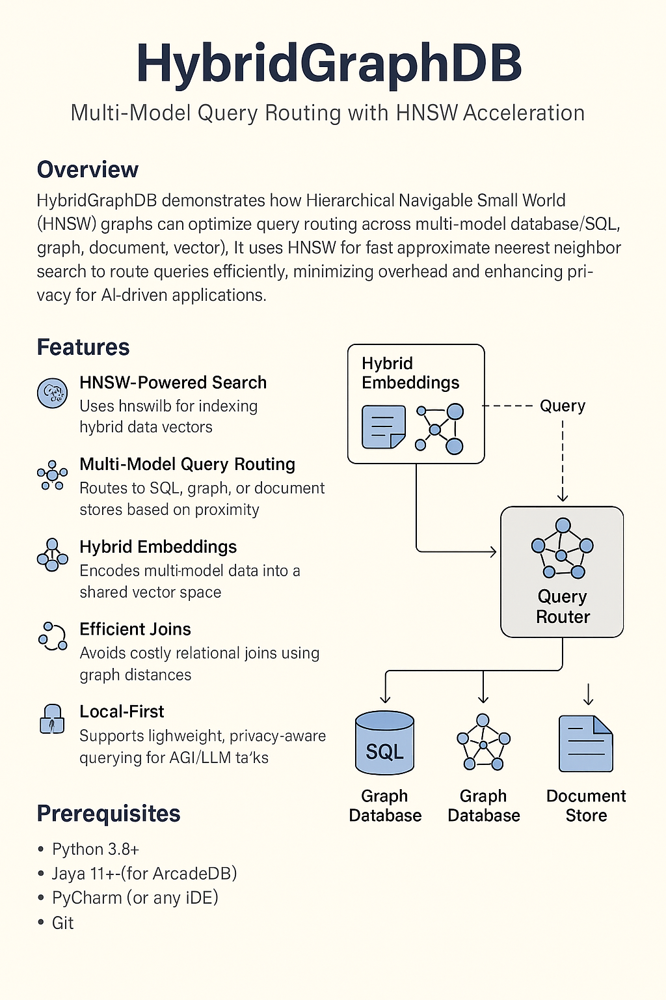

<div align="center">
  
</div>

<br/>


### 🧠 Overview
HybridGraphDB demonstrates how Hierarchical Navigable Small World (HNSW) graphs can optimize query routing across multi-model databases (SQL, graph, document, vector etc.).  
It uses HNSW for fast approximate nearest neighbor search to route queries efficiently, minimizing overhead and enhancing privacy for AI-driven applications.

### 🚀 Features
- **HNSW-Powered Search**: Uses `hnswlib` for indexing hybrid data vectors.  
- **Multi-Model Query Routing**: Routes to SQL, graph, or document stores based on proximity.  
- **Hybrid Embeddings**: Encodes multi-model data into a shared vector space.  
- **Efficient Joins**: Avoids costly relational joins using graph distances.  
- **Local-First**: Supports lightweight, privacy-aware querying for AGI/LLM tasks.  


---

## 🛠️ Prerequisites
- Python 3.8+  
- Java 11+ (for ArcadeDB)  
- PyCharm (or any IDE)  
- Git  

## ⚙️ Setup
1. **Clone the Repository**:
   ```bash
   git clone <repository-url>
   cd HybridGraphDB
